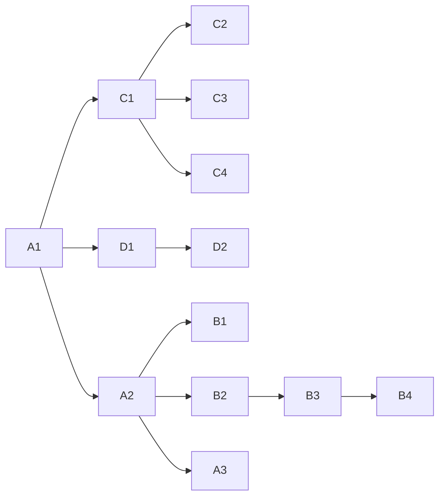

# Treinamento
Repositório para treinamento de novos voluntários

## Competências
A. Backend
  * A1 - [Instalação do Backend](instalacao_do_backend.md)
  * A2 - [NodeJS](nodejs.md)
  * A3 - Express

B. Frontend
  * B1 - Instalação do Frontend
  * B2 - Javascript no Navegador
  * B3 - React
  * B4 - React Native

C. Ambiente de Programação
  * C1 - [VS Code](vscode.md)
  * C2 - [Git](git.md)
  * C3 - Github
  * C4 - Docker

D. Gerência de Projetos
  * D1 - Markdown
  * D2 - Github Projects

## Sugestão de Fluxo
