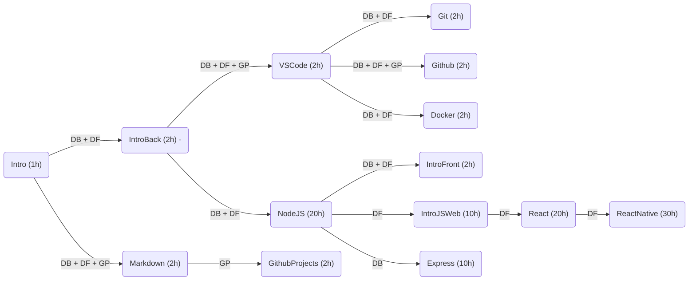

# Treinamento
Repositório para treinamento de novos voluntários

## Formações

CC. Conhecimento Comum
  * Intro: [Introdução](introducao.md)
  * Markdown: [Sintaxe de Documentação](markdown.md)
  * VS Code - [Ambiente de Programação](vscode.md)
  * Git - [Versionamento de Código](git.md)
  * Github - Github
  * Docker - Docker

DB. Desenvolvedor Backend (DB)
  * IntroBack - [IntroBack: Instalação do Backend](instalacao_do_backend.md)
  * NodeJS - [Programação Javascript em NodeJS](nodejs.md)
  * Express - [Framework Express](express.md)

DF. Desenvolvedor Frontend (DF)
  * IntroFront - Instalação do Frontend
  * IntroJSWeb - Javascript no Navegador
  * React - React
  * ReactNative - React Native
 
GP. Gerência de Projetos
  * GithubProjects - Github Projects

## Sugestão de Fluxo com Estimativa de Horas

