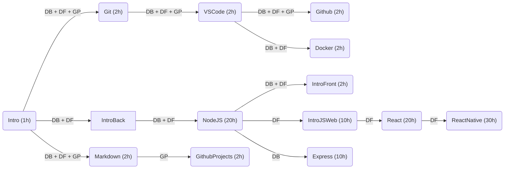

# Treinamento

Seja bem vindo ao treinamento de novos voluntários para o projeto de desenvolvimento de software da Comunidade [Zen-Budista Daissen](https://daissen.org.br/).

## Formações

A Equipe de voluntários elaborou uma formação para desenvolvedores de software que desejam colaborar com o projeto. A formação é dividida em três áreas de conhecimento: Desenvolvedor Backend, Desenvolvedor Frontend e Gerência de Projetos.

### Conhecimento Comum
  * [Intro: Informações Gerais](modulos/introducao/README.md)
  * [Markdown: Sintaxe de Documentação](modulos/markdown/README.md) 🚧
  * [VS Code: Ambiente de Programação](modulos/vscode/README.md) 🚧
  * [Git: Versionamento de Código](modulos/git/README.md)
  * [Github: Ambiente de Colaboração](modulos/github/README.md) 🚧
  * [Docker: Distribuição de Software](modulos/docker/README.md) 🚧

### Desenvolvedor Backend
  * [IntroBack: Instalação do Backend](modulos/instalacao_do_backend/README.md)
  * [NodeJS: Programação Javascript no Servidor](modulos/nodejs/README.md) 🚧 
  * [Express: Framework para Aplicações Backend](modulos/express/README.md) 🚧

### Desenvolvedor Frontend
  * [IntroFront: Instalação do Frontend](modulos/intro_frontend/README.md)
  * [IntroJSWeb: Javascript no Navegador](modulos/intro_js_web/README.md) 🚧
  * [React: Framework para Interface Web](modulos/react/README.md) 🚧
  * [ReactNative: Framework para Interface Móvel](modulos/react_native/README.md)
 
### Gerência de Projetos
  * [GithubProjects: Gerência de Projetos no Github](modulos/github_projects/README.md) 🚧

## Sugestão de Fluxo com Estimativa de Horas

## Desenvolvedores em Formação
* [gabriels404](em_formacao/gabriels404/README.md) - Formação Backend - desde 21/03/24
* [guinaka](em_formacao/guinaka/README.md) - Formação Backend - desde 04/04/24
* [mariaizabelg](em_formacao/mariaizabelg/README.md) - Formação Gerências de Projetos - desde 11/04/24
* [AlexandreDantasz](em_formacao/AlexandreDantasz/README.md) - Formação ? - desde 18/04/24

## Orientadores 🚧
* [marceloakira](orientadores/marceloakira/README.md)
* [lucamoreira](orientadores/lucamoreira/README.md)