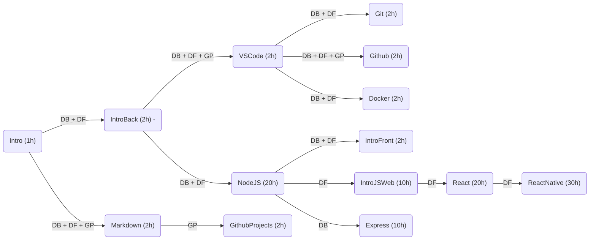

# Treinamento

Seja bem vindo ao treinamento de novos voluntários para o projeto de desenvolvimento de software da Comunidade [Zen-Budista Daissen](https://daissen.org.br/).

## Formações

A Equipe de voluntários elaborou uma formação para desenvolvedores de software que desejam colaborar com o projeto. A formação é dividida em três áreas de conhecimento: Desenvolvedor Backend, Desenvolvedor Frontend e Gerência de Projetos.

### Conhecimento Comum
  * [Intro: Informações Gerais](introducao.md)
  * [Markdown: Sintaxe de Documentação](markdown.md) 🚧
  * [VS Code: Ambiente de Programação](vscode.md) 🚧
  * [Git: Versionamento de Código](git.md) 🚧
  * [Github: Ambiente de Colaboração](github.md) 🚧
  * [Docker: Distribuição de Software](docker.md) 🚧

### Desenvolvedor Backend
  * [IntroBack: Instalação do Backend](instalacao_do_backend.md)
  * [NodeJS: Programação Javascript no Servidor](nodejs.md) 🚧 
  * [Express: Framework para Aplicações Backend](express.md) 🚧

### Desenvolvedor Frontend
  * [IntroFront: Instalação do Frontend](intro_frontend.md) 🚧
  * [IntroJSWeb: Javascript no Navegador](intro_js_web.md) 🚧
  * [React: Framework para Interface Web](react.md) 🚧
  * [ReactNative: Framework para Interface Móvel](react_native.md)
 
### Gerência de Projetos
  * [GithubProjects: Gerência de Projetos no Github](github_projects.md) 🚧

## Sugestão de Fluxo com Estimativa de Horas

