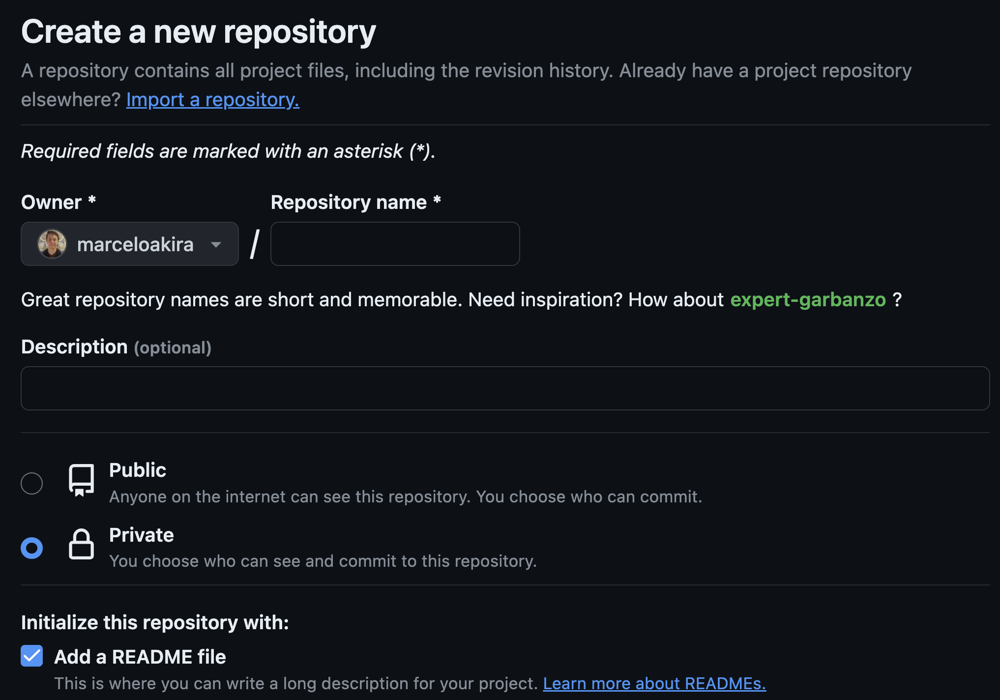

# Introdução ao git

## Introdução
* Git [2]  é um sistema de controle de versões distribuído (DVCS)
* Um Sistema de Controle de Versões [3] (VCS)  é um software que tem a finalidade de gerenciar diferentes versões no desenvolvimento de código-fonte ou documentos, geralmente codificiado em texto puro.
* Para executar os exemplos desse tutorial é necessário ter disponível:
  * git: veja como instalar no seu sistema operacional na seção abaixo
  * bash: para executar comandos de linha (ls, cd, etc), pode-se utilizar [Windows](https://www.techtudo.com.br/dicas-e-tutoriais/noticia/2016/04/como-instalar-e-usar-o-shell-bash-do-linux-no-windows-10.html) ou uma distribuição Linux (Debian, Ubuntu, Fedora, etc)
  * Um editor de texto como o Gnu Nano. Para instalar no Debian, Ubuntu ou derivados:
```bash
sudo apt-get install nano
```
  * Para instalar no Windows, use o [Chocolatey](https://chocolatey.org/install):
```bash
choco install nano
```

  * uma conta no [Github](https://www.github.com)
<!-- * Neste tutorial, o ambiente utilizado será GNU/Linux e o editor de texto utilizado será o Nano, disponível por padrão em distribuições baseadas em Debian
* No endereço http://www.inf.ufg.br/~marceloakira/vms é disponibilizado uma máquina virtual Lubuntu 18.04, customizada para ser leve e com todo software necessário instalado.  Sugere-se utilizar utilizar a última versão do [Virtualbox](https://www.virtualbox.org) -->
  
## Conceitos básicos
* O Git armazena seu conteúdo em um **repositório**, geralmente é um servidor, com um endereço de rede definido
* Um **repositório** geralmente é classificado por remoto ou local, geralmente por uma operação de clonagem, é possível copiar o repositório, criando-se uma repositório remoto em um repositório local.
* Por isso, o Git é considerado um DVCS, pois oferece ferramentas para que modificações feitas localmente sejam incorporadas a um repositório remoto.


* Fonte: https://git-scm.com/book/en/v2/Getting-Started-About-Version-Control

## Vantagens de usar git [3]
* **Controle do histórico:** facilidade em desfazer e possibilidade de analisar o histórico do desenvolvimento, como também facilidade no resgate de versões mais antigas e estáveis. A maioria das implementações permitem analisar as alterações com detalhes, desde a primeira versão até a última.
* **Trabalho em equipe:** um sistema de controle de versão permite que diversas pessoas trabalhem sobre o mesmo conjunto de documentos ao mesmo tempo e minimiza o desgaste provocado por problemas com conflitos de edições. É possível que a implementação também tenha um controle sofisticado de acesso para cada usuário ou grupo de usuários.
* **Marcação e resgate de versões estáveis:** a maioria dos sistemas permite marcar onde é que o documento estava com uma versão estável, podendo ser facilmente resgatado no futuro.
* **Ramificação de projeto:** a maioria das implementações possibilita a divisão do projeto em várias linhas de desenvolvimento, que podem ser trabalhadas paralelamente, sem que uma interfira na outra.
* **Segurança:** Cada software de controle de versão usa mecanismo para evitar qualquer tipo de invasão de agentes infecciosos nos arquivos. Além do mais, somente usuários com permissão poderão mexer no código.
* **Rastreabilidade:** com a necessidade de sabemos o local, o estado e a qualidade de um arquivo; o controle de versão trás todos esses requisitos de forma que o usuário possa ser embasar do arquivo que deseja utilizar.
* **Organização:** Com o software é disponibilizado interface visual que pode ser visto todo arquivos controlados, desde a origem até o projeto por completo.
* **Confiança:** O uso de repositórios remotos ajuda a não perder arquivos por eventos imponderáveis. Além disso e disponível fazer novos projetos sem danificar o desenvolvimento.
* Veja mais: https://pt.wikipedia.org/wiki/Sistema_de_controle_de_vers%C3%B5es#Principais_vantagens

## Breve história
* Criado em 2005 por Linus Torvarlds com a finalidade de apoiar o desenvolvimento do Kernel
* Características desejadas:
 * Desempenho
 * Projeto simples
 * Suporte para desenvolvimento não-linear (diversos ramos paralelos)
 * Totalmente distribuído
 * Suporte a grandes projetos como o Kernel Linux (desempenho e tamanho de dados)
* Leia mais: https://git-scm.com/book/en/v2/Getting-Started-A-Short-History-of-Git

## Instalação
* Para instalar no Debian, Ubuntu ou derivados:
```bash
sudo apt-get install git
```
* Para instalar no Windows:
    * Baixe o instalador no endereço https://git-scm.com/download/win
    * Execute o instalador e siga as instruções

## Configuração
* Antes de usar o git, é necessário realizar algumas configurações básicas. Antes de configurá-lo, verifique se o git há alguma configuração prévia:
```bash
git config --global --list

user.name=Marcelo Akira Inuzuka
user.email=marceloakira@ufg.br
```

* Caso não retorne nada, não há configurações prévias. Duas configurações são essenciais, execute as duas linhas seguintes, de acordo com seus dados pessoais:
```bash
git config --global user.name "Fulano da Silva"
git config --global user.email "fulano@example.com"
git config --global core.editor nano
```

* Verifique se deu certo:
```bash
git config --global --list
user.name=Fulano da Silva
user.email=fulano@example.com
core.editor=nano
```

* Estes comandos são importantes, pois eles vão identificar as modificações nos códigos-fonte dos repositórios.
* Leia mais: https://git-scm.com/book/en/v2/Getting-Started-First-Time-Git-Setup

## Como obter ajuda

* O git é baseado em comandos, para listar alguns execute
```bash
git help
```

```
usage: git [-v | --version] [-h | --help] [-C <path>] [-c <name>=<value>]
           [--exec-path[=<path>]] [--html-path] [--man-path] [--info-path]
           [-p | --paginate | -P | --no-pager] [--no-replace-objects] [--bare]
           [--git-dir=<path>] [--work-tree=<path>] [--namespace=<name>]
           [--super-prefix=<path>] [--config-env=<name>=<envvar>]
           <command> [<args>]

These are common Git commands used in various situations:

start a working area (see also: git help tutorial)
   clone     Clone a repository into a new directory
   init      Create an empty Git repository or reinitialize an existing one

work on the current change (see also: git help everyday)
   add       Add file contents to the index
   mv        Move or rename a file, a directory, or a symlink
   restore   Restore working tree files
   rm        Remove files from the working tree and from the index

examine the history and state (see also: git help revisions)
   bisect    Use binary search to find the commit that introduced a bug
   diff      Show changes between commits, commit and working tree, etc
   grep      Print lines matching a pattern
   log       Show commit logs
   show      Show various types of objects
   status    Show the working tree status

grow, mark and tweak your common history
   branch    List, create, or delete branches
   commit    Record changes to the repository
   merge     Join two or more development histories together
   rebase    Reapply commits on top of another base tip
   reset     Reset current HEAD to the specified state
   switch    Switch branches
   tag       Create, list, delete or verify a tag object signed with GPG

collaborate (see also: git help workflows)
   fetch     Download objects and refs from another repository
   pull      Fetch from and integrate with another repository or a local branch
   push      Update remote refs along with associated objects

'git help -a' and 'git help -g' list available subcommands and some
concept guides. See 'git help <command>' or 'git help <concept>'
to read about a specific subcommand or concept.
See 'git help git' for an overview of the system.
```

Para obter ajuda em um comando específico, execute 'git help <comando>', por exemplo:
```bash
git help clone

...
NAME
       git-clone - Clone a repository into a new directory
...
```

## Como criar um projeto no Gitlab ou Github

Há diversos servidores de repositórios git, os mais conhecidos são o Github e o Gitlab. Para criar um projeto, é necessário ter uma conta em um desses servidores.

* Logo depois de fazer o cadastro, é possível criar projetos em sua área pessoal, conhecido também como *namespace* pessoal. 
* Todo *namespace* pessoal pode ser acessado acrescentando-se o *login* cadastrado ao endereço do Gitlab (*https://www.gitlab.com*) ou Github (*https://github.com*), por exemplo:
* https://gitlab.com/marceloakira
  * onde: *marceloakira* é o *login* do usuário *marceloakira*
* Ou: https://github.com/marceloakira
  * onde: *marceloakira* é o *login* do usuário *marceloakira*

### Github
Para criar um novo repositório no Github, acesse o menu na sua página principal, conforme a figura abaixo:


Clique em *New repository* e preencha os campos conforme a figura abaixo:


Caso tenha criado corretamente, seu novo repositório será nesse endereço (URL):
```
https://github.com/seulogin/teste
```

Onde: *seulogin* é o seu login e *teste* é o nome do projeto criado.

### Gitlab
* Para criar um projeto, utilize a Interface Web ou acesse:
  * https://gitlab.com/projects/new
* Por padrão, o *namespace* pessoal será selecionado. Crie um projeto chamado testes, assim que for criado, o endereço do mesmo será, por exemplo:
  * https://gitlab.com/marceloakira/testes
* Ou seja, todo projeto no gitlab possui o seguinte padrão de endereço (URL): 
```
https://<servidor>/<namespace>/<projeto>
```
* Onde:
  * &lt;servidor&gt; é o nome do servidor do repositório, gitlab.com e github.com são os servidores mais comuns
  * &lt;namespace&gt; é o nome de um grupo ou de um usuário, no caso, 'marceloakira' é um namespace pertencente a um usuário
  * &lt;projeto&gt; é o nome do projeto criado pelo usuário 'marceloakira'

## Como copiar ou criar um repositório

* Há basicamente duas formas de se criar um repositório:
  * copiando-se um repositório remoto através do comando *git clone*
  * criando um novo repositório local através do comando *git init*
  
* Exemplo de cópia (clone) de repositório remoto:
```bash
git clone https://github.com/seulogin/teste
```

Onde *seulogin* é o seu login e *teste* é o nome do projeto criado.

Quando esse comando for executado, um diretório chamado *teste* será criado no diretório atual, contendo todos os arquivos do repositório remoto.

Visualize se a clonagem foi bem sucedida listando o conteúdo do diretório:
```bash
ls teste
```
no Linux

ou:
```bash
dir teste
```

Neste tutorial, por questão de foco, **não** irei explicar como criar um repositório local a partir do comando 'git init'. Para saber mais leia: https://git-scm.com/book/en/v2/Git-Basics-Getting-a-Git-Repository

## Como alterar e confirmar alterações locais

* Uma vez que você tenha uma cópia de um repositório remoto, você pode realizar alterações locais, tais como: alterar, criar ou deletar um arquivo. Por exemplo, veja o vídeo abaixo:

[](https://asciinema.org/a/BAmXek1u6ahmiRUUpCgjBF8r1)

## Referências

* [1] CHACON, S.; STRAUB, B. Pro Git. 2nd ed. edition ed. New York, NY: Apress, 2014. Disponível em https://git-scm.com/book/en/v2
* [2] Git. Disponível em: <https://git-scm.com/>. Acesso em: 20 ago. 2018. 
* [3] Sistema de controle de versões. In: Wikipédia, a enciclopédia livre. [s.l.: s.n.], 2018. Disponível em: <https://pt.wikipedia.org/w/index.php?title=Sistema_de_controle_de_vers%C3%B5es&oldid=51374216>. Acesso em: 20 ago. 2018.
* [4] Ramificação (Branching) no Git - O que é um Branch. Disponível em: <https://git-scm.com/book/pt-br/v1/Ramifica%C3%A7%C3%A3o-Branching-no-Git-O-que-%C3%A9-um-Branch>. Acesso em: 9 set. 2018.

## Licença
* &copy; Marcelo Akira Inuzuka - marceloakira@inf.ufg.br. Licenciado sob a licença [Atribuição-NãoComercial-CompartilhaIgual 3.0 Não Adaptada (CC BY-NC-SA 3.0)](https://creativecommons.org/licenses/by-nc-sa/3.0/deed.pt_BR)